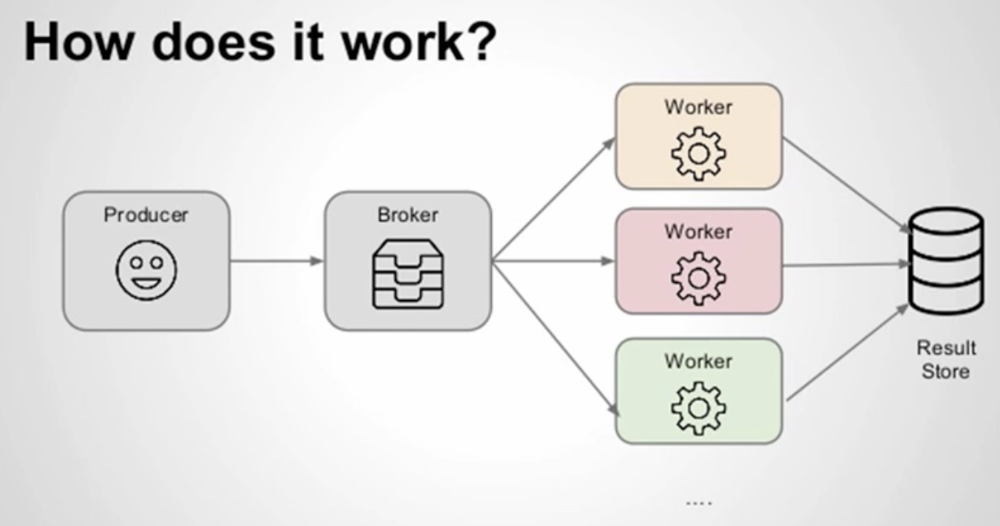
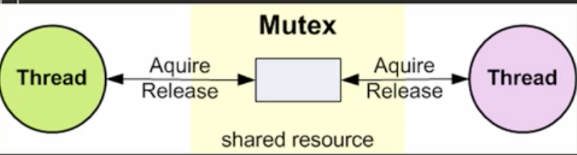
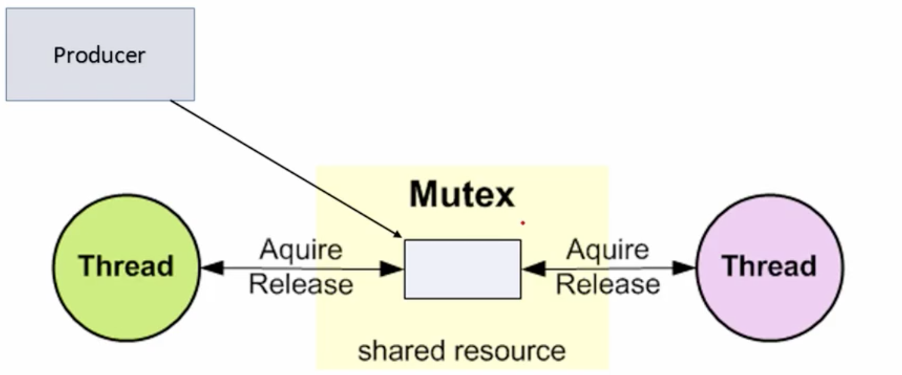

# Intro

Some scripts to introduce concurrency, threading and some concepts

# Consumer Producer problem

A producer can be:
One system produces items that will be used by other system or a request to perform an action

Consumer: Shared printer, web scraper module, social media data pull (e.g. twitter module)
payments processing module (stripe, paypal, bitcoin)

* One or more producers are generating data and placing it into a buffer
* A single consumer is taking data out of the buffer one at a time
* Only one consumer or producer can access the buffer one at a time

The problem:
* Ensuer producer can not add data on a full buffer
* Ensuer consumer can not remove data from an empty buffer
* Ensuer only one consumer(s) at a particular time can extract data

Problems that arises:
* Race conditions: occurs when multiple processes or thread read and write data items concurrently

Solutions:
* Mutual Exclusion: one process at a time gets in critical section. Locking and accessing can be controlled by code through semaphores monitors (not ideal distributed applications)
* Message passing : message sent through shared data structure consisting of queues. Exlusive locks by a dedicated consumer per message

When we talk about distributed applicacions and message queuing FIFO (first in first out), we talk about the consuler producer.
The queue can be a database broker or redis or other service that allow you to queue, like amazon SQS.
Consumer in the context of celery are consider workers, that will pull the results and push into a result store that can be a
database or even a flat file or other external system.

# Notes on scripts

## 03 mutex

A mutex can only be owned by one thread at a time and enabling threads to coordinate mutually exlusive access to a shared resource.

## 04 conditional

Conditions will control when a thread can access the shared resource, or in other words when it can acquire the lock. So we go back to the
acquire and release concepts nut conditionals statements allows us to be able to tell the producer whenever they are adding to the critical section
to the queue then onluy notify the threads to wake up from the sleeping state to actually acquire something from the critical sectino or shared resource or queue.

So we accomplish the consumers not to constantly trying to consume from the queue whenever is empty. The producer is the responsible to let the consumers know there
is something on the queue.

