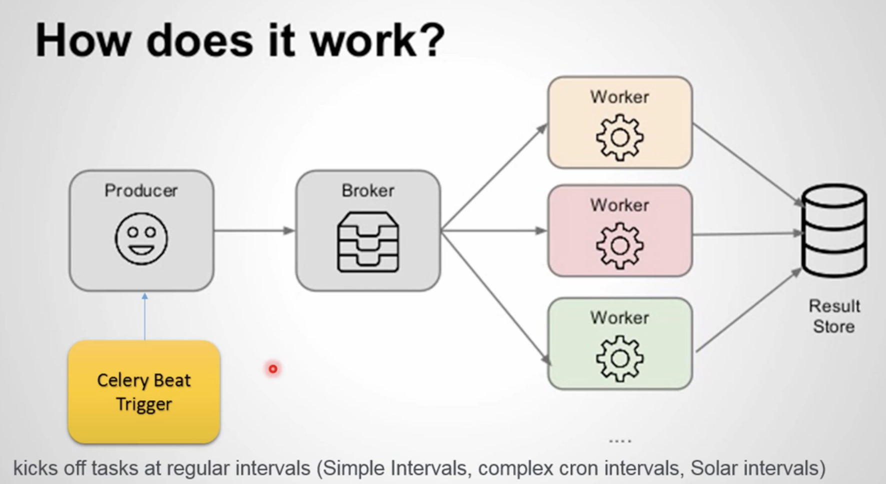

# Run

*First terminal*

If you do not have redis running, run it. `redis-server`

https://redis.io/docs/getting-started/installation/install-redis-on-mac-os/

*Second terminal*

$ celery -A tasks worker --loglevel=info

Where `tasks` is the name we inserted as first argument of Celery constructor.

This is the consumer or worker. If we want to run 10 workers, we should open 10 terminals
and execute this same command in all of them

*Third terminal*

$ python invoker.py

This is the proucer.


# Schedule tasks

Celery beat, is a celery worker that trigger tasks



The drawback of this, is that we loose control of the task executions. 
It tends to happend that one task is running, and it may take a long time to run or finish,
so the next task start, and they start to overlap.


How can we prevent a task to start if some other is running. 
There is a locking mechanism that control concurrent periodic tasks
and we see it in: TODO

Example Run, take not that there is no need to invoke the python itself. Beat will catch it.

```
❯ celery -A tasks worker --loglevel=info

[tasks]
  . tasks.add
  . tasks.data_extractor
  . tasks.send_mail_from_queue

[2022-09-20 13:53:18,833: INFO/MainProcess] Connected to redis://localhost:6379/0
[2022-09-20 13:53:18,842: INFO/MainProcess] mingle: searching for neighbors
[2022-09-20 13:53:19,860: INFO/MainProcess] mingle: all alone
[2022-09-20 13:53:19,873: INFO/MainProcess] celery@C02D76RPMD6N ready.
[2022-09-20 13:53:28,830: INFO/MainProcess] Received task: tasks.send_mail_from_queue[2f843059-2fc2-4fec-9233-ee1016d0d74a]
[2022-09-20 13:53:28,832: WARNING/ForkPoolWorker-16] Email message successfully sent, [example.email]
[2022-09-20 13:53:28,833: WARNING/ForkPoolWorker-16] release resources
[2022-09-20 13:53:28,833: INFO/ForkPoolWorker-16] Task tasks.send_mail_from_queue[2f843059-2fc2-4fec-9233-ee1016d0d74a] succeeded in 0.0021437909999999505s: None
[2022-09-20 13:53:31,807: INFO/MainProcess] Received task: tasks.send_mail_from_queue[194a996a-f2dd-4e8b-bf5d-195d3d83289d]
[2022-09-20 13:53:31,808: WARNING/ForkPoolWorker-2]  Email message successfully sent, [example.email]
[2022-09-20 13:53:31,810: WARNING/ForkPoolWorker-2] release resources
[2022-09-20 13:53:31,810: INFO/ForkPoolWorker-2] Task tasks.send_mail_from_queue[194a996a-f2dd-4e8b-bf5d-195d3d83289d] succeeded in 0.0023004029999995623s: None
[2022-09-20 13:53:34,807: INFO/MainProcess] Received task: tasks.send_mail_from_queue[73ac2744-760e-4cb2-b664-bef8c2d984ad]
[2022-09-20 13:53:34,809: WARNING/ForkPoolWorker-4] Email message successfully sent, [example.email]
[2022-09-20 13:53:34,810: WARNING/ForkPoolWorker-4] release resources
[2022-09-20 13:53:34,811: INFO/ForkPoolWorker-4] Task tasks.send_mail_from_queue[73ac2744-760e-4cb2-b664-bef8c2d984ad] succeeded in 0.0028140060000012568s: None
```

Second terminal

```
❯ celery -A tasks beat --loglevel=info
celery beat v4.3.0 (rhubarb) is starting.
LocalTime -> 2022-09-20 13:53:25
Configuration ->
    . broker -> redis://localhost:6379/0
    . loader -> celery.loaders.app.AppLoader
    . scheduler -> celery.beat.PersistentScheduler
    . db -> celerybeat-schedule
    . logfile -> [stderr]@%INFO
    . maxinterval -> 5.00 minutes (300s)
[2022-09-20 13:53:25,799: INFO/MainProcess] beat: Starting...
[2022-09-20 13:53:28,816: INFO/MainProcess] Scheduler: Sending due task tasks.send_mail_from_queue (tasks.send_mail_from_queue)
[2022-09-20 13:53:31,805: INFO/MainProcess] Scheduler: Sending due task tasks.send_mail_from_queue (tasks.send_mail_from_queue)
[2022-09-20 13:53:34,805: INFO/MainProcess] Scheduler: Sending due task tasks.send_mail_from_queue (tasks.send_mail_from_queue)
[2022-09-20 13:53:37,805: INFO/MainProcess] Scheduler: Sending due task tasks.send_mail_from_queue (tasks.send_mail_from_queue)
```

# Mutual Exclusion

Imagine we have tasks that will ran concurrently. For example we have 3 workers that run same task.
There is a chance that code works reading some record and doing something with it. And if there are 3 tasks at the same
time grabbing the same record, then we have a concurrencu problem.

So we need to apply mutual exlusion between workers

For example, code sending mail can read a record. So this part should be locked:


We are going to execute them, but this time we are going to execute more than one worker and we are going to name each one with the `-n` parameter.

`celery -A tasks worker --loglevel=info -n worker1@localhost`
`celery -A tasks worker --loglevel=info -n worker2@localhost`
`celery -A tasks worker --loglevel=info -n worker3@localhost`

## Implementation

There are some implementations that you can read here: https://redis.io/docs/reference/patterns/distributed-locks/

We are going to use redis that we have installed and comes with celery (`pip install -U celery[redis]`)
