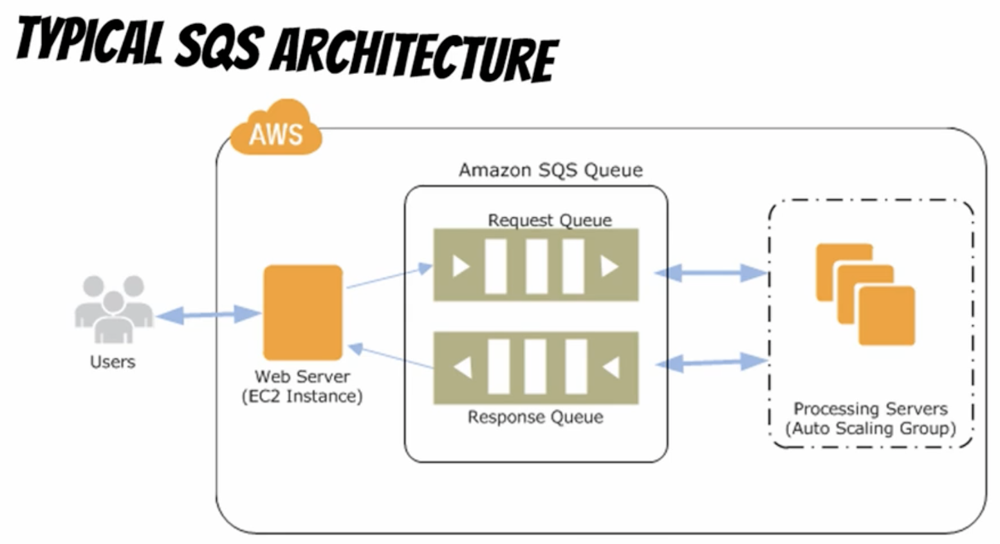
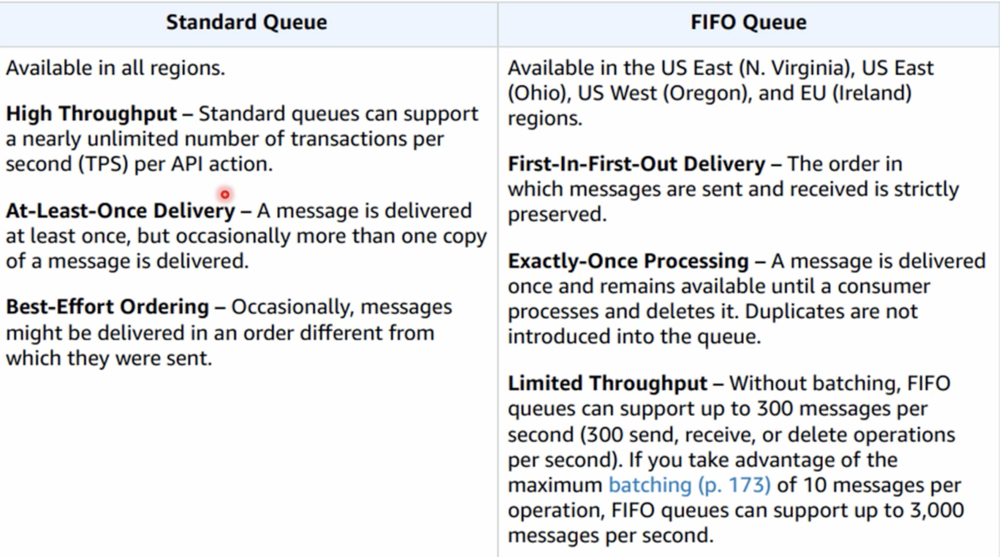
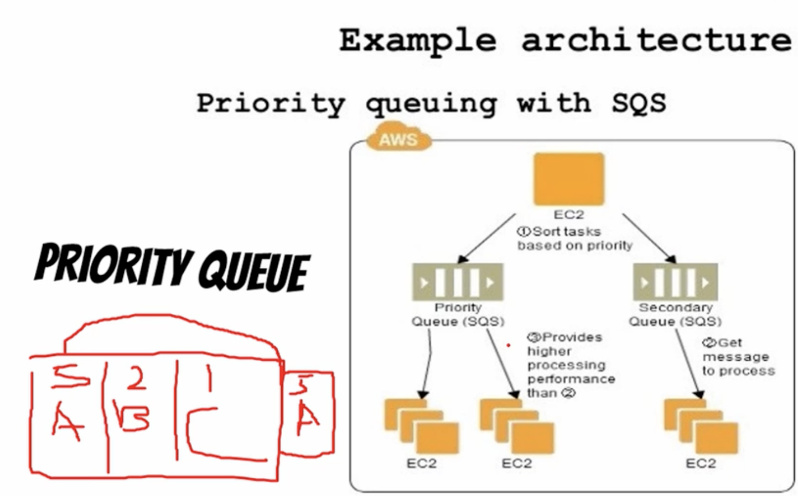

# What is SQS?

Amazon Simple Queue Server (Amazon SQS) offers a reliable, highly-scalable managed hosted queue for inter
communication between applications or microservies. SQS moves data between distributed application components and helps you decouple.

Good thing is that you do not have to manage infrastructure, scalability, etc.
You do not have to leverahe other methods like APIs, soap, etc to communicate between components/microservices. You use SQS.

# Typical Architecture

Imagine we have a server in a region and then an app in another region of AWS, then we can use SQS reliabably and scalably to communicate them.

Same concept is applied to other queues like RabbitMQ, Apache Kafka, MicrosoftMQ. Where we have the producer and consumer.

Looking at the celery example, imagine that the autoscale group hast a bunch of workers that send emails. We do not have infinite resources
and we can not send inifinite emails. So with SQS queue we throttle the amount of emails that are sent by the workers, feeding workers 
when we have resources available.

# Types of queue in SQS

Amazon does not come with *priority queues*. What are they? Basically each element in the queue has a weight, and the greater the weight
the bigger the priority it has. So if we have three elements with weights 5, 2, 1. Then the element with 5 will be sent first.
That is a drawback and we have to build it ourselves.

We can for example have more amount of workers configured to pick up stuff from the priority queue, and if there is nothing there then 
they can go and pick up from the secondary queue.

